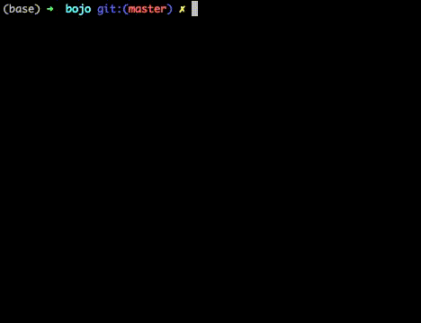

# bojo

`bojo` is a command-line bullet journal. If you're new to bullet journals, check out [/r/bulletjournal](https://www.reddit.com/r/bulletjournal/) or the bullet journal [website](https://bulletjournal.com/).



## Getting Started

Install the tool using

```
pip install bojo
```

It should be relatively self-explanatory to get started with. Here are the possible commands:

```
> bojo --help

Usage: bojo [OPTIONS] COMMAND [ARGS]...

  A command-line bullet journal.

Options:
  --help  Show this message and exit.

Commands:
  add       Adds a new item
  complete  Mark an item as complete
  delete    Delete an item forever
  info      Provides information about annotation
  list      Lists relevant items
```

So, to add a new entry, just do:

```
> bojo add

Description: Make a cool bullet journal command line tool
State: x
Signifier [none]: !
Parent [none]:
Time [none]: tomorrow at 6pm
! x Make a cool bullet journal command line tool Thursday, June 18, 2020 at 6:00 PM
Do you want to add this item? [y/N]: y
Added item
```

To see our existing entries, do:

```
> bojo list

Last 1 item(s):
1 ! x Make a cool bullet journal command line tool Thursday, June 18, 2020 at 6:00 PM

Upcoming 1 item(s):
1 ! x Make a cool bullet journal command line tool Thursday, June 18, 2020 at 6:00 PM
```

Once we've completed an entry, do:

```
> bojo mark complete 1

OR

> bojo mark x 1

1 ! x Make a cool bullet journal command line tool Thursday, June 18, 2020 at 6:00 PM
Marked item 1 as complete
```

## Notes

**Shouldn't "bullet journal" be abbreviated "bujo", not "bojo"?**

I mean, yeah, technically. It's faster to type "bojo" into the command line, though.

## Environment Variables

- `BOJO_ROOT` points to the root path for storing data. By default, this is `~/.bojo`
- `BOJO_VERBOSE` is an option which, when set, toggles verbose mode (not just symbols). This is good for when you're getting started.
- `BOJO_NUM_ITEMS` sets the number of items to list by default
